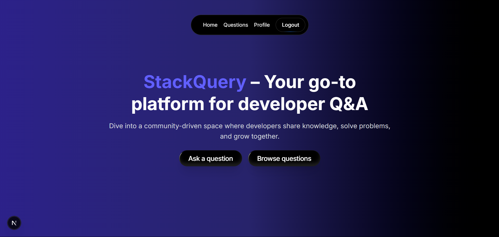
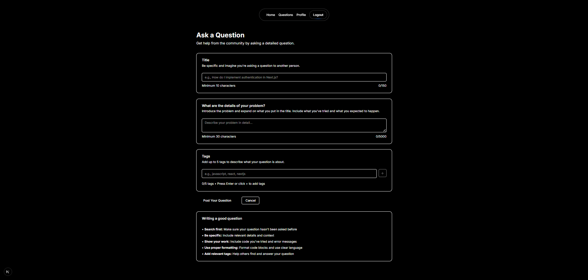
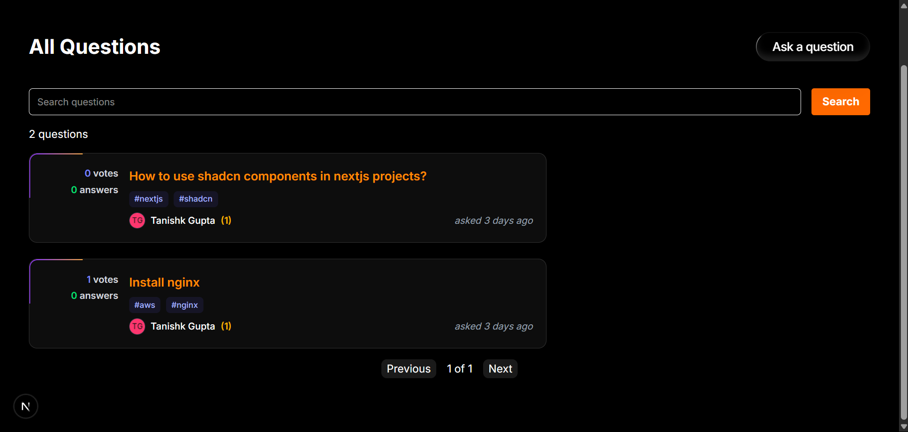
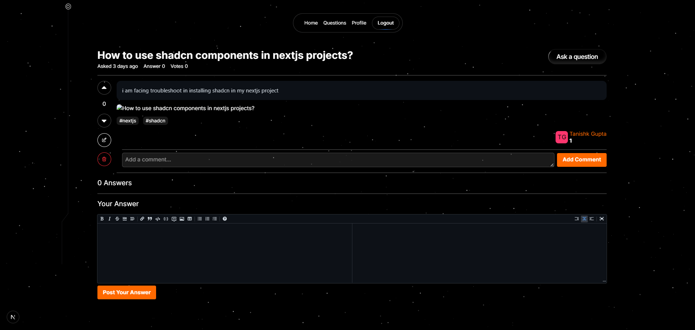
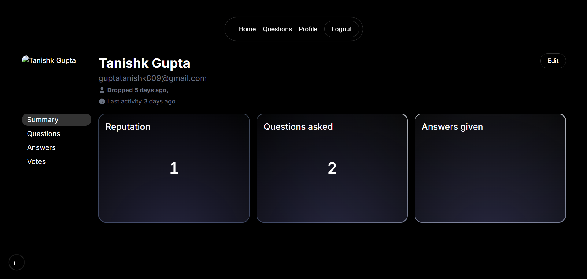

# StackQuery

StackQuery is a full-stack Question & Answer platform built for developers — allowing users to ask, answer, and explore technical questions across various domains.

Built with modern web technologies like **Next.js**, **React**, **TailwindCSS**, and **Appwrite** for scalable authentication, database, and file storage.

## Features

- User Authentication (Login/Signup with Appwrite)
- Ask and Answer Developer Questions
- Voting System for Questions and Answers
- User Profiles and Avatar Support
- Filter by Category/Tags
- Powerful Search and Responsive UI

## Tech Stack

| Technology       | Usage                             |
|------------------|-----------------------------------|
| Next.js          | React framework for SSR & routing |
| React            | Frontend UI components            |
| TailwindCSS      | Utility-first CSS styling         |
| Appwrite         | Backend services (auth, DB, files)|
| TypeScript       | Static typing for reliability     |

## Screenshots







## Getting Started

### Prerequisites

- Node.js >= 18
- Appwrite self-hosted instance OR [Appwrite Cloud](https://cloud.appwrite.io/)
- Git

### 1. Clone the Repository

```bash
git clone https://github.com/tanishkgupta-18/StackQuery.git
cd StackQuery
